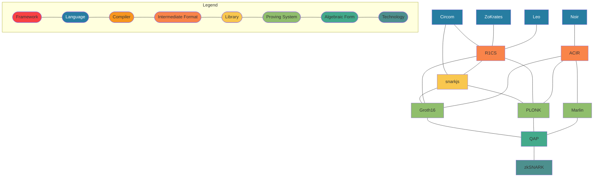

```mermaid
graph TD
    Circom[Circom] --- R1CS[R1CS]
    Noir[Noir] --- ACIR[ACIR]
    Zokrates[ZoKrates] --- R1CS
    Leo[Leo] --- R1CS
    snarkjs --- PLONK[PLONK]
    snarkjs --- Groth16[Groth16]
    Circom --- snarkjs
    R1CS --- snarkjs
    R1CS --- PLONK
    R1CS --- Groth16
    Groth16 --- QAP[QAP]
    PLONK --- QAP
    ACIR ---- Marlin
    ACIR ---- PLONK
    ACIR ---- Groth16
    Marlin[Marlin] --- QAP
    QAP --- zkSNARK[zkSNARK]
    
    subgraph Legend
      Framework([Framework])---Lang([Language])---Compiler([Compiler])---Intermediate([Intermediate Format])---Library([Library])---ProvingSystem([Proving System])---AlgebraicForm([Algebraic Form])---Tech([Technology])
    end
    
    classDef framework fill:#f94144
    classDef lang fill:#277da1,color:#fff
    classDef compiler fill:#f8961e
    classDef intermediate fill:#f9844a
    classDef lib fill:#f9c74f
    classDef provingSystem fill:#90be6d
    classDef algForm fill:#43aa8b
    classDef tech fill:#4d908e
    classDef color9 fill:#f3722c
    classDef color10 fill:#577590
    
    class Framework framework
    class Lang,Circom,Zokrates,Leo,Noir lang
    class Compiler compiler
    class Intermediate,R1CS,ACIR intermediate
    class Library,snarkjs lib
    class ProvingSystem,Groth16,PLONK,Marlin provingSystem
    class AlgebraicForm,QAP algForm
    class Tech,zkSNARK tech
    
    click Circom href "https://docs.circom.io/"
    click Zokrates href "https://zokrates.github.io/"
    click Leo href "https://leo-lang.org/"
    click Noir href "https://docs.aztec.network/developers/noir"
```
