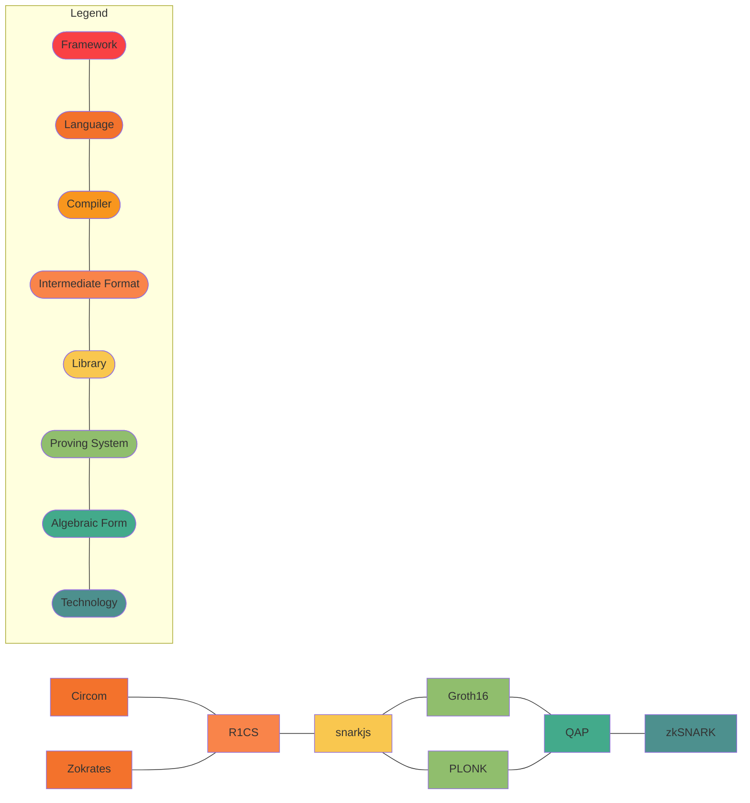

```mermaid
graph LR
    Circom[Circom] --- R1CS[R1CS]
    Zokrates[Zokrates] --- R1CS
    R1CS --- snarkjs[snarkjs]
    snarkjs --- PLONK[PLONK]
    snarkjs --- Groth16[Groth16]
    Groth16 --- QAP[QAP]
    PLONK --- QAP
    QAP --- zkSNARK[zkSNARK]
    
    subgraph Legend
      Framework([Framework])---Lang([Language])---Compiler([Compiler])---Intermediate([Intermediate Format])---Library([Library])---ProvingSystem([Proving System])---AlgebraicForm([Algebraic Form])---Tech([Technology])
    end
    
    classDef green fill:#9f6,stroke:#333,stroke-width:2px;
    classDef orange fill:#f96,stroke:#333,stroke-width:4px;
    classDef framework fill:#f94144
    classDef lang fill:#f3722c
    classDef compiler fill:#f8961e
    classDef intermediate fill:#f9844a
    classDef lib fill:#f9c74f
    classDef provingSystem fill:#90be6d
    classDef algForm fill:#43aa8b
    classDef tech fill:#4d908e
    classDef color9 fill:#577590
    classDef color10 fill:#277da1
    
    class Framework framework
    class Lang,Circom,Zokrates lang
    class Compiler compiler
    class Intermediate,R1CS intermediate
    class Library,snarkjs lib
    class ProvingSystem,Groth16,PLONK provingSystem
    class AlgebraicForm,QAP algForm
    class Tech,zkSNARK tech
    
    click Circom href "https://docs.circom.io/"
```
