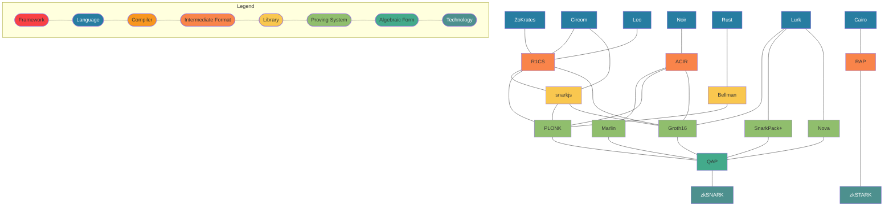

# A(n almost) complete atlas of Zero-Knowledge Proof technologies

```mermaid
graph TD
    subgraph Legend
        Framework([Framework])---Lang([Language])---Compiler([Compiler])---Intermediate([Intermediate Format])---Library([Library])---ProvingSystem([Proving System])---AlgebraicForm([Algebraic Form])---Tech([Technology])
    end
    Rust[Rust] ---- Bellman[Bellman]
    Circom[Circom] --- R1CS[R1CS]
    snarkjs --- PLONK[PLONK]
    snarkjs --- Groth16[Groth16]
    R1CS --- snarkjs
    R1CS --- PLONK
    R1CS --- Groth16
    Zokrates[ZoKrates] --- R1CS
    Leo[Leo] --- R1CS
    Bellman --- PLONK
    Noir[Noir] --- ACIR[ACIR]
    Marlin[Marlin] --- QAP
    Lurk ----- Groth16
    Lurk ----- SnarkPack[SnarkPack+]
    Lurk ----- Nova[Nova]
    Circom ---- snarkjs 
    Groth16 --- QAP[QAP]
    PLONK --- QAP
    SnarkPack --- QAP
    Nova --- QAP
    ACIR ---- Marlin
    ACIR ---- PLONK
    ACIR ---- Groth16
    QAP --- zkSNARK[zkSNARK]
    Cairo[Cairo] --- RAP[RAP]
    RAP ------ zkSTARK[zkSTARK]
    
    classDef framework fill:#f94144
    classDef lang fill:#277da1,color:#fff
    classDef compiler fill:#f8961e
    classDef intermediate fill:#f9844a
    classDef lib fill:#f9c74f
    classDef provingSystem fill:#90be6d
    classDef algForm fill:#43aa8b
    classDef tech fill:#4d908e,color:#fff
    classDef color9 fill:#f3722c
    classDef color10 fill:#577590
    
    class Framework framework
    class Lang,Circom,Zokrates,Leo,Noir,Cairo,Lurk,Rust lang
    class Compiler compiler
    class Intermediate,R1CS,ACIR,RAP intermediate
    class Library,snarkjs,Bellman lib
    class ProvingSystem,Groth16,PLONK,Marlin,SnarkPack,Nova provingSystem
    class AlgebraicForm,QAP algForm
    class Tech,zkSNARK,zkSTARK tech
    
    click Circom href "https://docs.circom.io/"
    click Zokrates href "https://zokrates.github.io/"
    click Leo href "https://leo-lang.org/"
    click Noir href "https://docs.aztec.network/developers/noir"
    click snarkjs href "https://github.com/iden3/snarkjs"
    click Cairo href "https://eprint.iacr.org/2021/1063.pdf"
    click RAP href "https://eprint.iacr.org/2021/1063.pdf"
    click Lurk href "https://github.com/lurk-lang"
    click SnarkPack href "https://research.protocol.ai/blog/2021/snarkpack-how-to-aggregate-snarks-efficiently/"
    click Nova href "https://github.com/microsoft/Nova"
    click Bellman href "https://github.com/matter-labs/bellman"
    click Rust href "https://www.rust-lang.org/"
```
Inspired by [https://harryr.github.io/zklangs/](https://harryr.github.io/zklangs/)
