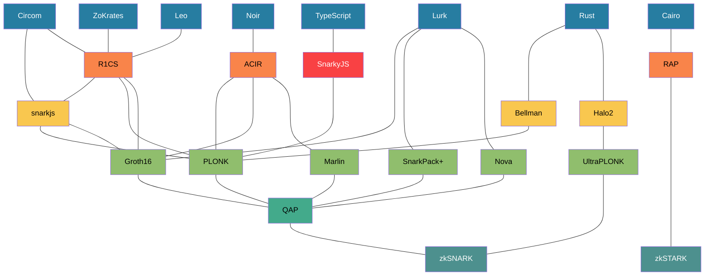

# A(n almost) complete atlas of Zero-Knowledge Proof technologies

Most of the blocks are clickable!

```mermaid
graph LR
    subgraph Legend
        direction LR
        Lang([Language])---Framework([Framework])---Compiler([Compiler])---Intermediate([Intermediate Format])---Library([Library])---ProvingSystem([Proving System])---AlgebraicForm([Algebraic Form])---Tech([Technology])
    end
    
    linkStyle default stroke-width:0px;
    
    classDef framework fill:#f94144,color:#fff
    classDef lang fill:#277da1,color:#fff
    classDef compiler fill:#f8961e,color:#000
    classDef intermediate fill:#f9844a,color:#000
    classDef lib fill:#f9c74f,color:#000
    classDef provingSystem fill:#90be6d,color:#000
    classDef algForm fill:#43aa8b,color:#000
    classDef tech fill:#4d908e,color:#fff
    classDef color9 fill:#f3722c,color:#000
    classDef color10 fill:#577590,color:#000
    
    class Framework framework
    class Lang lang
    class Compiler compiler
    class Intermediate intermediate
    class Library lib
    class ProvingSystem provingSystem
    class AlgebraicForm algForm
    class Tech tech
```

---
Inspired by [https://harryr.github.io/zklangs/](https://harryr.github.io/zklangs/).
This diagram is using [Mermaid syntax](https://mermaid-js.github.io/mermaid/#/).
